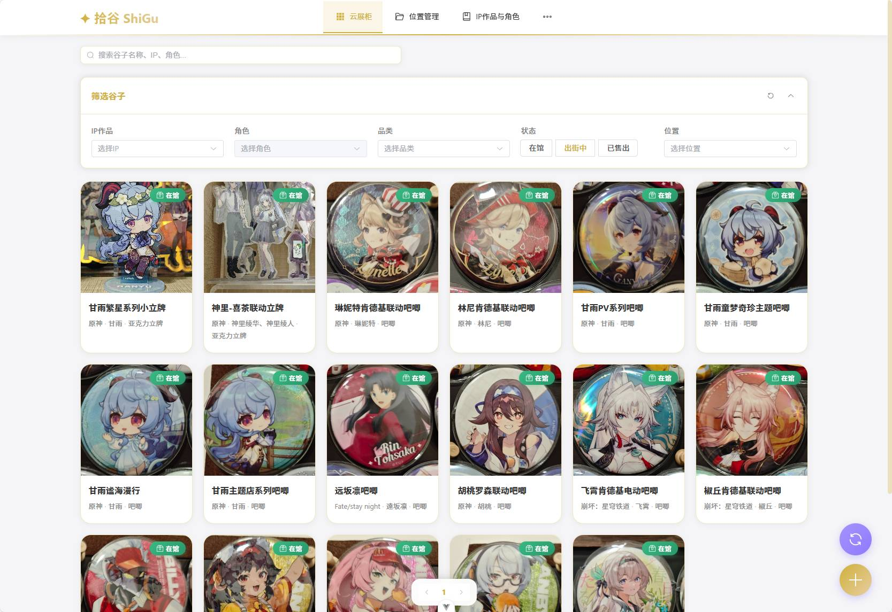
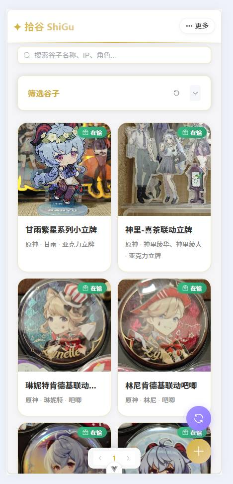
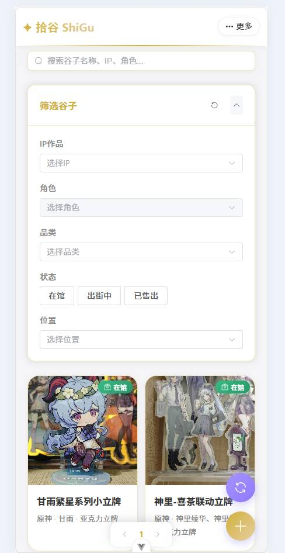
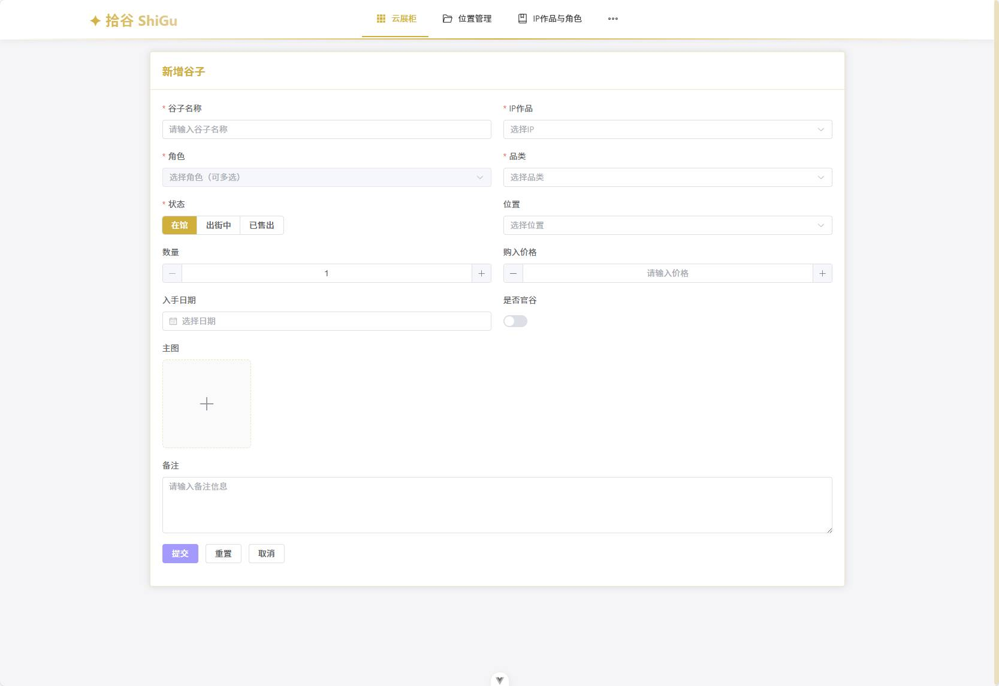
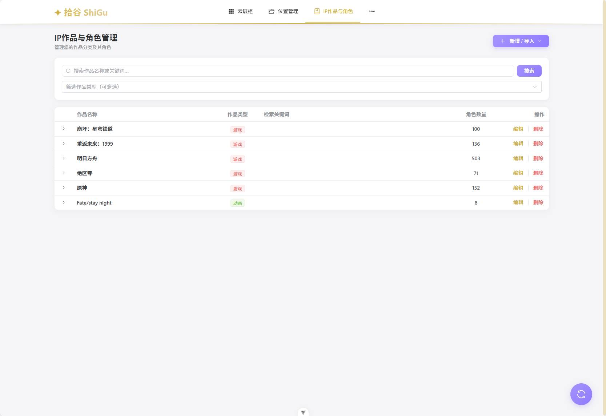
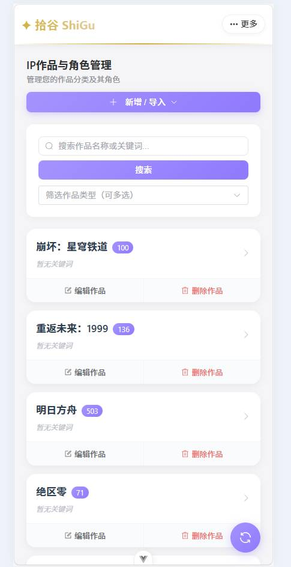
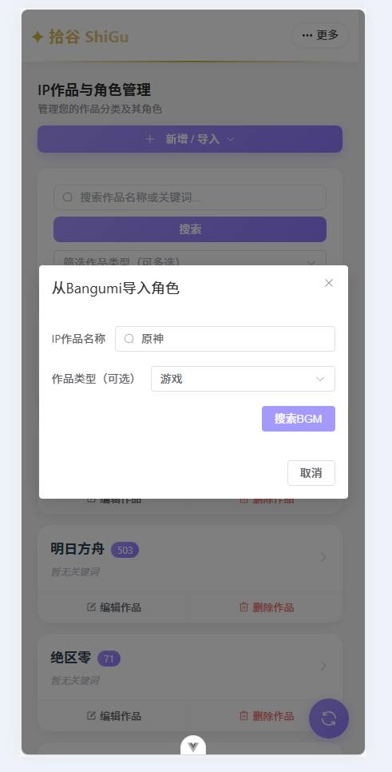
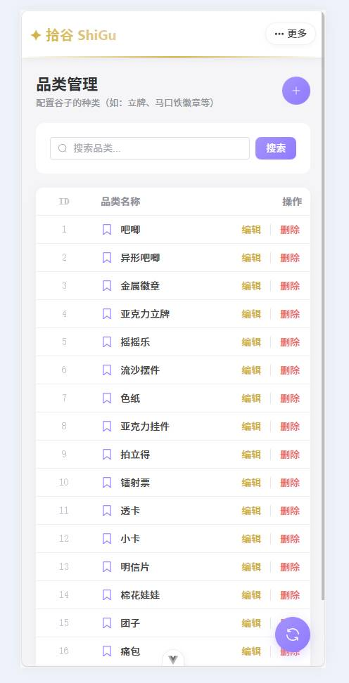

# 拾谷 PickGoods 前端

<div align="center">


**专业的二次元收藏品数字化资产管理平台前端实现**

[快速开始](#-快速开始) • [功能特性](#-功能特性) • [技术栈](#️-技术栈) • [项目结构](#-项目结构)

</div>

---

## 📖 项目简介

**拾谷 PickGoods** 是一个面向二次元收藏爱好者（谷子玩家）的专业数字化资产管理平台。系统致力于将物理收藏品转化为数字化资产，提供"云展柜式"的检索体验与高效的收纳管理能力。

### 核心定位

- **数字化收纳**：将实体手办、周边等收藏品完整数字化，建立个人收藏档案
- **智能检索**：300ms 防抖搜索 + 多维筛选，快速定位目标藏品
- **数据导入**：支持从 Bangumi 批量导入 IP 作品与角色信息，大幅提升录入效率
- **跨端适配**：完整支持 PC 端与移动端，随时随地管理收藏

### 核心价值

| 价值点 | 说明 |
|--------|------|
| 🎯 **精准检索** | 支持 IP、角色、品类、状态、位置等多维度筛选，300ms 防抖优化搜索体验 |
| 📦 **层级管理** | 树形结构管理收纳位置，清晰展示藏品分布情况 |
| 🚀 **高效录入** | BGM 批量导入、表单联动校验、图片上传一体化，提升录入效率 80%+ |
| 🎨 **视觉体验** | 香槟镭射主题设计，精致的交互细节，流畅的动画效果 |
| 📱 **响应式设计** | PC 端表格展示，移动端卡片展示，完美适配不同设备 |

### 界面总览

<div align="center">

<div style="display: flex; justify-content: center; gap: 20px; flex-wrap: wrap;">

<div>



*PC 端云展柜主界面*

</div>

<div>



*移动端云展柜主界面*

</div>

</div>

</div>

---

## 🚀 快速开始

### 环境要求

| 工具 | 版本要求 | 说明 |
|------|----------|------|
| Node.js | ≥ 20.19.0 或 ≥ 22.12.0 | 推荐使用 LTS 版本 |
| pnpm | ≥ 9.0.0 | 项目已锁定 packageManager: pnpm@9.0.0 |
| 浏览器 | 支持 ES2020+ | Chrome 90+、Firefox 88+、Safari 14+、Edge 90+ |

### 安装与运行

```bash
# 1. 克隆项目
git clone <repository-url>
cd PickGoods_vue

# 2. 安装依赖
pnpm install

# 3. 配置环境变量（如需要）
# 创建 .env 文件，配置后端 API 地址
# VITE_API_BASE_URL=http://127.0.0.1:8000

# 4. 启动开发服务器
pnpm dev
# 访问 http://localhost:5173
```

### 开发命令

```bash
# 开发
pnpm dev              # 启动开发服务器（热更新）

# 构建
pnpm build            # 生产环境构建（包含类型检查）
pnpm build-only       # 仅构建，不进行类型检查
pnpm preview          # 预览生产构建结果

# 代码质量
pnpm type-check       # TypeScript 类型检查
pnpm lint             # ESLint 代码检查与自动修复

# 测试
pnpm test:unit        # 运行单元测试（Vitest）
```

### 项目配置

#### 环境变量

创建 `.env` 文件（参考 `.env.example`，如存在）：

```env
# 后端 API 基础地址
VITE_API_BASE_URL=http://127.0.0.1:8000
```

> **注意**：开发环境下，`vite.config.ts` 已配置代理，将 `/api` 请求转发至 `http://127.0.0.1:8000`。生产环境请配置实际的后端服务地址。

#### 开发服务器代理

开发服务器已配置代理，无需手动处理跨域：

```typescript:20:27:vite.config.ts
  server: {
    proxy: {
      '/api': {
        target: 'http://127.0.0.1:8000',
        changeOrigin: true,
      },
    },
  },
```

## 📁 项目结构

```
PickGoods_vue/
├── public/              # 静态资源目录
│   └── favicon.ico     # 网站图标
├── src/
│   ├── api/            # API 接口层
│   │   ├── goods.ts           # 谷子相关接口（CRUD、图片上传）
│   │   ├── location.ts        # 位置管理接口（树形结构操作）
│   │   ├── metadata.ts        # 元数据接口（IP、角色、品类、BGM 导入）
│   │   └── types.ts           # TypeScript 类型定义（共享类型）
│   │
│   ├── components/     # 公共组件库
│   │   ├── Layout.vue          # 主布局组件（导航栏、路由视图、悬浮按钮）
│   │   ├── SearchBar.vue       # 搜索栏组件（300ms 防抖处理）
│   │   ├── FilterPanel.vue     # 筛选面板组件（多维筛选器）
│   │   ├── GoodsCard.vue       # 谷子卡片组件（展示卡片）
│   │   └── GoodsDrawer.vue     # 详情抽屉组件（图片画廊、详细信息展示）
│   │
│   ├── stores/         # Pinia 状态管理
│   │   ├── guzi.ts            # 谷子数据管理（搜索、筛选、分页状态）
│   │   └── location.ts        # 位置树数据管理（树形结构状态）
│   │
│   ├── styles/         # 样式与主题
│   │   ├── variables.css           # CSS 变量定义（主题色、间距等）
│   │   ├── element-plus-theme.css  # Element Plus 主题定制
│   │   └── index.css               # 全局样式重置与基础样式
│   │
│   ├── utils/          # 工具函数
│   │   ├── request.ts         # Axios 封装（错误处理、限流提示、请求拦截）
│   │   └── tree.ts            # 树结构转换工具（扁平化 ↔ 树形结构）
│   │
│   ├── views/          # 业务页面视图
│   │   ├── CloudShowcase.vue         # 云展柜（主检索页面）
│   │   ├── LocationManagement.vue    # 位置管理（树形导航、位置 CRUD）
│   │   ├── GoodsForm.vue             # 资产录入/编辑表单（表单校验、图片上传）
│   │   ├── IPCharacterManagement.vue # IP作品与角色管理（BGM 导入、关键词管理）
│   │   └── CategoryManagement.vue    # 品类管理（品类 CRUD）
│   │
│   ├── router/         # 路由配置
│   │   └── index.ts    # 路由定义（包含旧路由兼容性重定向）
│   │
│   ├── __tests__/      # 单元测试
│   │   └── App.spec.ts # 应用入口测试
│   │
│   ├── App.vue         # 应用根组件
│   └── main.ts         # 应用入口文件
│
├── dist/               # 构建输出目录（生产环境）
├── .env.d.ts          # 环境变量类型声明
├── eslint.config.ts   # ESLint 配置
├── vite.config.ts     # Vite 构建配置（代理、别名等）
├── tsconfig.json      # TypeScript 配置
├── vitest.config.ts   # Vitest 测试配置
├── package.json       # 项目依赖与脚本
└── README.md          # 项目说明文档（本文件）
```

### 目录说明

| 目录 | 职责 | 说明 |
|------|------|------|
| `api/` | API 层 | 统一封装后端接口，提供类型安全的调用方式 |
| `components/` | 组件库 | 可复用的 UI 组件，遵循单一职责原则 |
| `stores/` | 状态管理 | Pinia stores，管理全局状态（搜索、筛选、位置树等） |
| `views/` | 页面视图 | 业务页面组件，组合使用公共组件 |
| `utils/` | 工具函数 | 通用工具函数（HTTP 请求封装、树结构转换等） |
| `styles/` | 样式文件 | 主题变量、全局样式、Element Plus 主题定制 |
| `router/` | 路由配置 | Vue Router 路由定义与导航守卫 |

## ✨ 功能特性

### 🎨 云展柜（Cloud Showcase）

**路由**：`/showcase` | **默认首页**

核心检索与展示功能，提供"云展柜式"的浏览体验。

| 功能 | 说明 | 技术实现 |
|------|------|----------|
| 🔍 **智能搜索** | 300ms 防抖搜索，避免频繁请求触发限流 | `lodash-es` 防抖 + Pinia Store |
| 🎯 **多维筛选** | IP、角色、品类、状态、位置等多维度筛选 | `FilterPanel` 组件 + 动态查询参数 |
| 📱 **响应式布局** | PC 端网格展示，移动端卡片展示，自动适配 | CSS Grid + Flexbox + 媒体查询 |
| 📖 **详情抽屉** | 点击卡片弹出详情抽屉，展示完整信息与图片画廊 | `GoodsDrawer` 组件 + Element Plus Drawer |
| 📄 **分页导航** | 固定在底部，毛玻璃效果，不遮挡内容 | 自定义样式 + `el-pagination` |
| ⚡ **快捷操作** | 右键菜单提供编辑、删除等快捷操作 | 自定义右键菜单组件 |
| 🔗 **位置跳转** | 点击位置路径跳转到位置管理页并高亮 | Vue Router 编程式导航 |

**组件依赖**：
- `SearchBar.vue` - 搜索栏组件
- `FilterPanel.vue` - 筛选面板组件
- `GoodsCard.vue` - 谷子卡片组件
- `GoodsDrawer.vue` - 详情抽屉组件

**界面展示**：

<div align="center">

#### PC 端界面


*PC 端云展柜主界面 - 网格展示与多维筛选*

</div>

<div align="center">

#### 移动端界面

<div style="display: flex; justify-content: center; gap: 20px; flex-wrap: wrap;">

<div>


*移动端首页 - 卡片式展示*

</div>

<div>



*移动端筛选面板 - 多维筛选器*

</div>

</div>

</div>

---

### 📍 位置管理（Location Management）

**路由**：`/location`

层级化位置管理，支持树形导航与位置详情展示。

| 功能 | 说明 | 技术实现 |
|------|------|----------|
| 🌳 **树形导航** | 树形结构展示收纳位置，支持展开/折叠 | Element Plus Tree + 递归组件 |
| 📋 **位置详情** | 展示位置名称、描述、照片等详细信息 | 侧边详情面板 |
| 📦 **位置资产** | 展示该位置下的所有谷子列表 | 联动查询，基于位置的筛选 |
| ✏️ **CRUD 操作** | 支持位置的增删改操作 | RESTful API + 表单校验 |
| 🔍 **位置搜索** | 支持按路径名称搜索位置节点 | 前端过滤或后端查询 |

**状态管理**：`stores/location.ts` - 管理位置树状态

---

### 📝 资产录入（Goods Form）

**路由**：`/goods/new`（新增） | `/goods/:id/edit`（编辑）

完整的资产录入与编辑表单，支持图片上传与联动选择。

| 功能 | 说明 | 技术实现 |
|------|------|----------|
| ✅ **表单校验** | 完整的字段校验规则，实时反馈错误 | Element Plus Form 校验规则 |
| 🔗 **联动选择** | IP-角色联动选择，避免选择无效组合 | 级联选择器 + 数据过滤 |
| 👥 **多角色关联** | 支持一个谷子关联多个角色 | 多选下拉框 + 后端 `character_ids` 字段 |
| 📷 **图片上传** | 主图上传功能，已对接后端接口 | FormData + Axios 文件上传 |
| 🖼️ **补充图片** | 补充图片管理（UI 已实现） | 图片预览与删除功能 |
| ⚠️ **冲突检测** | 409 冲突检测，友好的幂等性提示 | HTTP 状态码处理 |

**API 接口**：
- `POST /api/goods/` - 创建谷子
- `PUT /api/goods/{id}/` - 更新谷子
- `POST /api/goods/{id}/upload-main-photo/` - 上传主图

**界面展示**：

<div align="center">

<div style="display: flex; justify-content: center; gap: 20px; flex-wrap: wrap;">

<div>



*PC 端资产录入表单*

</div>

<div>


*移动端资产录入表单 - 响应式布局*

</div>

</div>

</div>

---

### 🎭 IP作品与角色管理（IP & Character Management）

**路由**：`/ipcharacter` | **兼容路由**：`/ip`、`/character`（自动重定向）

统一管理 IP 作品与角色，支持 BGM 批量导入与关键词管理。

| 功能 | 说明 | 技术实现 |
|------|------|----------|
| 📊 **列表展示** | PC 端表格展示，移动端卡片展示 | 响应式表格组件 |
| 🔽 **展开/折叠** | IP 下角色列表展开/折叠查看，懒加载优化 | Element Plus Table expand |
| 🏷️ **关键词管理** | IP 关键词管理（别名/缩写），支持多关键词 | 标签组件 + CRUD 操作 |
| 📸 **头像上传** | 角色头像上传功能 | 图片上传组件 |
| 🔍 **搜索功能** | 按 IP 名称或关键词搜索 | 前端过滤 + 后端查询 |
| ⭐ **BGM 导入** | 从 Bangumi 批量导入 IP 作品与角色 | 多步骤流程 + 批量创建 API |

#### BGM 批量导入流程

1. **搜索作品**：通过 Bangumi API 搜索作品
2. **选择角色**：展示角色列表，支持筛选与批量选择
3. **批量导入**：调用后端批量创建接口
4. **结果反馈**：展示导入结果统计（成功创建、已存在跳过、错误详情）

**API 接口**：
- `POST /api/bgm/search-characters/` - 搜索 Bangumi 作品并获取角色列表
- `POST /api/bgm/create-characters/` - 批量创建 IP 和角色

**界面展示**：

<div align="center">

#### PC 端界面



*PC 端 IP 作品与角色管理 - 表格展示与展开/折叠*

</div>

<div align="center">

#### 移动端界面

<div style="display: flex; justify-content: center; gap: 20px; flex-wrap: wrap;">

<div>



*移动端 IP 管理 - 卡片式展示*

</div>

<div>


*移动端角色列表展示 - 展开查看角色详情*

</div>

</div>

#### BGM 批量导入流程展示

<div style="display: flex; justify-content: center; gap: 20px; flex-wrap: wrap;">

<div>



*步骤 1：搜索 Bangumi 作品*

</div>

<div>


*步骤 2：选择角色并批量导入*

</div>

</div>

</div>

---

### 📦 品类管理（Category Management）

**路由**：`/category`

独立的品类管理页面，支持品类的完整 CRUD 操作。

| 功能 | 说明 | 技术实现 |
|------|------|----------|
| 📋 **列表展示** | 表格形式展示品类列表 | Element Plus Table |
| 🔍 **搜索功能** | 按品类名称搜索 | 前端过滤或后端查询 |
| ✏️ **CRUD 操作** | 支持品类的增删改操作 | RESTful API + 表单校验 |

**界面展示**：

<div align="center">



*移动端品类管理界面 - 表格展示与搜索功能*

</div>

---

### 🎨 设计规范

#### 主题风格：香槟镭射（Champagne Laser）

| 颜色 | 色值 | 用途 |
|------|------|------|
| **主色** | `#D4AF37`（香槟金） | 边框、图标高亮、强调色 |
| **辅助色** | `#F5F5F7`（明亮灰） | 卡片背景、次要背景 |
| **点缀色** | `#A29BFE`（镭射紫） | 主要按钮、渐变效果、链接色 |

#### 视觉规范

- **圆角规范**：卡片 20px，按钮 8px，输入框 4px
- **间距规范**：基于 8px 网格系统
- **响应式断点**：移动端 < 768px，平板 768px - 1024px，PC 端 > 1024px
- **性能目标**：首屏加载位置树 + 谷子列表 ≤ 1.5s（内网环境）

#### 交互细节

- ✅ 香槟金边框与高亮效果
- ✅ 镭射动效与渐变背景
- ✅ 毛玻璃效果（分页器、下拉菜单）
- ✅ 流畅的过渡动画
- ✅ 友好的加载状态与错误提示

## 📦 部署说明

### 构建生产版本

```bash
# 构建生产版本（包含类型检查）
pnpm build

# 仅构建，不进行类型检查（更快）
pnpm build-only
```

构建产物将输出到 `dist/` 目录。

### 预览生产构建

```bash
# 本地预览生产构建结果
pnpm preview
```

### 部署选项

#### 选项 1：静态文件服务器（推荐）

将 `dist/` 目录部署到静态文件服务器（如 Nginx、Apache、Vercel、Netlify 等）。

**Nginx 配置示例**：

```nginx
server {
    listen 80;
    server_name your-domain.com;
    root /path/to/dist;
    index index.html;

    location / {
        try_files $uri $uri/ /index.html;
    }

    location /api {
        proxy_pass http://your-backend-server:8000;
        proxy_set_header Host $host;
        proxy_set_header X-Real-IP $remote_addr;
    }
}
```

#### 选项 2：CDN 部署

将 `dist/` 目录上传到 CDN（如阿里云 OSS、腾讯云 COS、AWS S3 等）。

#### 选项 3：容器化部署

使用 Docker 构建镜像（如需要）：

```dockerfile
FROM nginx:alpine
COPY dist/ /usr/share/nginx/html/
EXPOSE 80
CMD ["nginx", "-g", "daemon off;"]
```

### 环境变量配置

生产环境需配置 `VITE_API_BASE_URL` 环境变量，指向后端 API 服务地址。

**方式 1**：构建时设置

```bash
VITE_API_BASE_URL=https://api.your-domain.com pnpm build
```

**方式 2**：运行时配置（需修改代码）

通过 `window.__ENV__` 等全局变量注入配置。

---

## 📱 移动端开发（Capacitor）

本项目使用 [Capacitor](https://capacitorjs.com/) 将 Vue 3 应用打包为原生移动应用，支持 Android 和 iOS 平台。

### 什么是 Capacitor？

Capacitor 是由 Ionic 团队开发的跨平台应用运行时，允许您使用 Web 技术（HTML、CSS、JavaScript/TypeScript）构建原生移动应用，并提供了丰富的原生 API 桥接能力。

**核心优势**：
- ✅ **一次开发，多端运行**：同一套代码可同时构建 Android 和 iOS 应用
- ✅ **原生性能**：使用原生 WebView 容器，性能接近原生应用
- ✅ **丰富的插件生态**：支持访问相机、文件系统、网络状态等原生功能
- ✅ **渐进式迁移**：现有 Web 应用可无缝迁移，无需重写代码
- ✅ **与框架无关**：支持 Vue、React、Angular 等主流前端框架

### 前置要求

#### Android 开发环境

| 工具 | 版本要求 | 说明 |
|------|----------|------|
| **Java JDK** | ≥ 17 | 推荐使用 OpenJDK 17 或 Oracle JDK 17 |
| **Android Studio** | ≥ 最新稳定版 | 包含 Android SDK 和 Gradle |
| **Android SDK** | API Level 33+ | 通过 Android Studio SDK Manager 安装 |
| **Gradle** | 8.0+ | 通常随 Android Studio 自动安装 |

**安装步骤**：

1. **安装 Java JDK 17**
   - Windows：下载并安装 [Oracle JDK](https://www.oracle.com/java/technologies/javase/jdk17-archive-downloads.html) 或 [OpenJDK](https://adoptium.net/)
   - macOS：使用 Homebrew：`brew install openjdk@17`
   - Linux：使用包管理器：`sudo apt install openjdk-17-jdk`

2. **安装 Android Studio**
   - 下载并安装 [Android Studio](https://developer.android.com/studio)
   - 启动 Android Studio，通过 SDK Manager 安装：
     - Android SDK Platform 33+
     - Android SDK Build-Tools
     - Android SDK Platform-Tools
     - Android Emulator（如需要）

3. **配置环境变量**（Windows）
   ```powershell
   # 添加到系统环境变量
   ANDROID_HOME=C:\Users\YourUsername\AppData\Local\Android\Sdk
   JAVA_HOME=C:\Program Files\Java\jdk-17
   PATH=%PATH%;%ANDROID_HOME%\platform-tools;%ANDROID_HOME%\tools
   ```

4. **配置环境变量**（macOS/Linux）
   ```bash
   # 添加到 ~/.zshrc 或 ~/.bashrc
   export ANDROID_HOME=$HOME/Library/Android/sdk  # macOS
   # export ANDROID_HOME=$HOME/Android/Sdk        # Linux
   export JAVA_HOME=$(/usr/libexec/java_home -v 17)  # macOS
   export PATH=$PATH:$ANDROID_HOME/platform-tools:$ANDROID_HOME/tools
   ```

#### iOS 开发环境（仅 macOS）

| 工具 | 版本要求 | 说明 |
|------|----------|------|
| **macOS** | ≥ 13.0 (Ventura) | iOS 开发仅支持 macOS 系统 |
| **Xcode** | ≥ 15.0 | 包含 iOS SDK 和模拟器 |
| **CocoaPods** | ≥ 1.13.0 | iOS 依赖管理工具 |
| **Node.js** | ≥ 20.19.0 | 项目运行环境 |

**安装步骤**：

1. **安装 Xcode**
   - 从 App Store 安装 [Xcode](https://apps.apple.com/app/xcode/id497799835)
   - 启动 Xcode，接受许可协议
   - 通过 Xcode → Preferences → Components 安装 iOS 模拟器

2. **安装 Xcode Command Line Tools**
   ```bash
   xcode-select --install
   ```

3. **安装 CocoaPods**
   ```bash
   sudo gem install cocoapods
   ```

### 项目配置

#### Capacitor 配置文件

项目根目录的 `capacitor.config.ts` 文件包含 Capacitor 的核心配置：

```typescript:capacitor.config.ts
import type { CapacitorConfig } from '@capacitor/cli';

const config: CapacitorConfig = {
  appId: 'com.pickgoods.app',        // 应用唯一标识符（反向域名）
  appName: '拾谷',                 // 应用显示名称
  webDir: 'dist',                 // Web 构建输出目录
  server: {
    androidScheme: 'http',        // Android 使用的 URL Scheme
    cleartext: true               // 允许 HTTP 连接（开发环境）
  }
};

export default config;
```

**配置说明**：
- `appId`：应用的唯一标识符，用于区分不同的应用。建议使用反向域名格式（如 `com.yourcompany.appname`）
- `appName`：应用在设备上显示的名称
- `webDir`：Vue 构建后的输出目录，Capacitor 会将此目录内容复制到原生项目中
- `server.androidScheme`：Android 使用的 URL Scheme，生产环境建议改为 `https`
- `server.cleartext`：允许 HTTP 连接（仅开发环境，生产环境应禁用）

#### 已安装的 Capacitor 插件

项目已集成以下 Capacitor 插件：

| 插件 | 版本 | 用途 |
|------|------|------|
| `@capacitor/core` | ^8.0.0 | Capacitor 核心库 |
| `@capacitor/android` | ^8.0.0 | Android 平台支持 |
| `@capacitor/status-bar` | ^8.0.0 | 状态栏样式控制 |
| `@capacitor/network` | ^8.0.0 | 网络状态检测 |
| `@capacitor-community/http` | ^1.4.1 | HTTP 请求增强（支持 CORS） |

### Android 平台

#### 1. 初始化 Android 平台（首次设置）

如果项目中还没有 `android/` 目录，需要初始化 Android 平台：

```bash
# 先构建 Web 应用
pnpm build

# 添加 Android 平台
npx cap add android

# 同步文件（将 Web 构建产物复制到 Android 项目）
npx cap sync android
```

#### 2. 开发流程

**步骤 1：构建 Web 应用**

每次修改 Vue 代码后，需要重新构建并同步到原生项目：

```bash
# 构建生产版本
pnpm build

# 同步到 Android 项目（将 dist/ 目录内容复制到 android/app/src/main/assets/public/）
npx cap sync android
```

**步骤 2：在 Android Studio 中打开项目**

```bash
# 使用 Android Studio 打开 Android 项目
npx cap open android
```

或者手动打开：
1. 启动 Android Studio
2. 选择 "Open an Existing Project"
3. 选择项目根目录下的 `android/` 文件夹

**步骤 3：运行应用**

- **在模拟器中运行**：
  1. 在 Android Studio 顶部工具栏选择模拟器
  2. 点击绿色的 "Run" 按钮（或按 `Shift + F10`）

- **在真实设备上运行**：
  1. 启用设备的"开发者选项"和"USB 调试"
  2. 使用 USB 连接设备到电脑
  3. 在 Android Studio 中选择设备，点击 "Run"

**步骤 4：调试**

- **Chrome DevTools**：
  1. 在 Android Studio 中运行应用
  2. 打开 Chrome 浏览器，访问 `chrome://inspect`
  3. 找到设备中的应用，点击 "inspect"

- **Android Studio Logcat**：
  - 在 Android Studio 底部打开 "Logcat" 标签
  - 可以查看应用的日志输出

#### 3. 构建 APK/AAB

**构建调试版 APK**：

```bash
# 方法 1：使用 Gradle 命令行
cd android
./gradlew assembleDebug  # macOS/Linux
# gradlew.bat assembleDebug  # Windows

# 生成的 APK 位置：android/app/build/outputs/apk/debug/app-debug.apk
```

**构建发布版 AAB（用于 Google Play）**：

1. 在 Android Studio 中：
   - 菜单栏 → Build → Generate Signed Bundle / APK
   - 选择 "Android App Bundle"
   - 创建或选择签名密钥（Keystore）
   - 选择 Release 构建类型
   - 完成构建

2. 使用 Gradle 命令行：
   ```bash
   cd android
   ./gradlew bundleRelease
   # 生成的 AAB 位置：android/app/build/outputs/bundle/release/app-release.aab
   ```

#### 4. Android 特定配置

**AndroidManifest.xml**（`android/app/src/main/AndroidManifest.xml`）：

```xml
<!-- 权限配置（如需要） -->
<uses-permission android:name="android.permission.INTERNET" />
<uses-permission android:name="android.permission.CAMERA" />

<!-- 应用图标和启动画面配置 -->
<!-- 可在 android/app/src/main/res/ 目录下配置 -->
```

**build.gradle**（`android/app/build.gradle`）：

```gradle
android {
    defaultConfig {
        applicationId "com.pickgoods.app"  // 应用包名
        minSdkVersion 22                // 最低支持的 Android 版本
        targetSdkVersion 34             // 目标 Android 版本
        versionCode 1                   // 版本号（整数）
        versionName "1.0"               // 版本名称（字符串）
    }
}
```

### iOS 平台

#### 1. 初始化 iOS 平台（首次设置）

如果项目中还没有 `ios/` 目录，需要初始化 iOS 平台：

```bash
# 先构建 Web 应用
pnpm build

# 添加 iOS 平台（仅 macOS）
npx cap add ios

# 安装 CocoaPods 依赖
cd ios/App
pod install
cd ../..

# 同步文件（将 Web 构建产物复制到 iOS 项目）
npx cap sync ios
```

#### 2. 开发流程

**步骤 1：构建 Web 应用**

每次修改 Vue 代码后，需要重新构建并同步到原生项目：

```bash
# 构建生产版本
pnpm build

# 同步到 iOS 项目（将 dist/ 目录内容复制到 ios/App/App/public/）
npx cap sync ios
```

**步骤 2：在 Xcode 中打开项目**

```bash
# 使用 Xcode 打开 iOS 项目
npx cap open ios
```

或者手动打开：
1. 启动 Xcode
2. 选择 "Open a project or file"
3. 选择项目根目录下的 `ios/App/App.xcworkspace` 文件（注意：必须是 `.xcworkspace`，不是 `.xcodeproj`）

**步骤 3：配置签名**

1. 在 Xcode 中选择项目（左侧导航栏最上方）
2. 选择 "Signing & Capabilities" 标签
3. 选择你的 Team（需要 Apple Developer 账号）
4. Xcode 会自动生成 Provisioning Profile

**步骤 4：运行应用**

- **在模拟器中运行**：
  1. 在 Xcode 顶部工具栏选择模拟器（如 iPhone 15 Pro）
  2. 点击绿色的 "Run" 按钮（或按 `Cmd + R`）

- **在真实设备上运行**：
  1. 使用 USB 连接设备到 Mac
  2. 在设备上信任此电脑
  3. 在 Xcode 中选择设备，点击 "Run"
  4. 首次运行需要在设备上：设置 → 通用 → VPN 与设备管理 → 信任开发者

**步骤 5：调试**

- **Safari Web Inspector**：
  1. 在 Mac 上打开 Safari
  2. 菜单栏 → 开发 → [设备名称] → [应用名称]
  3. 可以查看控制台、网络请求、调试代码

- **Xcode Console**：
  - 在 Xcode 底部打开 Console 标签
  - 可以查看应用的日志输出

#### 3. 构建 IPA

**构建发布版 IPA（用于 App Store）**：

1. **Archive 构建**：
   - 在 Xcode 中选择 "Any iOS Device" 作为目标
   - 菜单栏 → Product → Archive
   - 等待构建完成

2. **上传到 App Store**：
   - 在 Archive 窗口点击 "Distribute App"
   - 选择 "App Store Connect"
   - 选择上传方式（自动或手动）
   - 完成上传

**构建 Ad Hoc 或 Enterprise 版本**：

在 Archive 窗口选择相应的分发方式。

#### 4. iOS 特定配置

**Info.plist**（`ios/App/App/Info.plist`）：

```xml
<!-- 权限说明（如需要） -->
<key>NSCameraUsageDescription</key>
<string>需要访问相机以拍摄藏品照片</string>

<key>NSPhotoLibraryUsageDescription</key>
<string>需要访问相册以选择照片</string>
```

**Podfile**（`ios/App/Podfile`）：

```ruby
platform :ios, '13.0'  # 最低支持的 iOS 版本
```

### 开发与调试

#### Live Reload（热重载）

Capacitor 支持开发时的 Live Reload，无需每次手动构建和同步：

**方式 1：使用 Capacitor CLI（推荐）**

```bash
# 终端 1：启动 Vite 开发服务器
pnpm dev

# 终端 2：启动 Capacitor Live Reload（Android）
npx cap run android -l --external

# 终端 2：启动 Capacitor Live Reload（iOS）
npx cap run ios -l --external
```

**方式 2：配置 capacitor.config.ts**

```typescript
const config: CapacitorConfig = {
  // ... 其他配置
  server: {
    url: 'http://192.168.1.100:5173',  // 你的本机 IP:Vite 端口
    cleartext: true
  }
};
```

然后在原生应用中运行，代码修改会自动刷新。

#### 常用命令

```bash
# 同步 Web 构建产物到原生项目
npx cap sync                    # 同步所有平台
npx cap sync android            # 仅同步 Android
npx cap sync ios                # 仅同步 iOS

# 打开原生项目
npx cap open android            # 在 Android Studio 中打开
npx cap open ios                # 在 Xcode 中打开

# 复制 Web 构建产物（不同步插件）
npx cap copy android
npx cap copy ios

# 更新原生依赖
npx cap update                  # 更新所有平台
npx cap update android
npx cap update ios

# 运行应用（需要已配置开发环境）
npx cap run android
npx cap run ios
```

### 构建与发布

#### 构建流程

1. **构建 Web 应用**：
   ```bash
   # 确保环境变量正确
   VITE_API_BASE_URL=https://api.your-domain.com pnpm build
   ```

2. **同步到原生项目**：
   ```bash
   npx cap sync android  # 或 npx cap sync ios
   ```

3. **在原生 IDE 中构建**：
   - Android：在 Android Studio 中构建 APK/AAB
   - iOS：在 Xcode 中 Archive 并导出 IPA

#### 版本管理

**Android（`android/app/build.gradle`）**：

```gradle
android {
    defaultConfig {
        versionCode 2        // 每次发布递增（整数）
        versionName "1.0.1"  // 版本号（字符串）
    }
}
```

**iOS（`ios/App/App.xcodeproj/project.pbxproj` 或通过 Xcode）**：

- 在 Xcode 中：选择项目 → General → Identity → Version / Build
- Version：版本号（如 1.0.1）
- Build：构建号（如 2，每次递增）

**同步版本号**：

可以在 `package.json` 中管理版本号，通过脚本同步到原生项目。

### 注意事项

#### 1. 网络请求

- **开发环境**：`capacitor.config.ts` 中配置了 `cleartext: true`，允许 HTTP 请求
- **生产环境**：应使用 HTTPS，或配置网络安全策略（Android）和 App Transport Security（iOS）

#### 2. API 地址配置

生产环境应用需要使用真实的 API 地址，不能使用 `localhost` 或 `127.0.0.1`。

**方式 1：构建时配置环境变量**
```bash
VITE_API_BASE_URL=https://api.your-domain.com pnpm build
npx cap sync android
```

**方式 2：在原生代码中配置**
- Android：可以在 `MainActivity.java` 中注入全局变量
- iOS：可以在 `AppDelegate.swift` 中注入全局变量

#### 3. 状态栏配置

项目已在 `src/main.ts` 中配置了状态栏样式：

```typescript
import { StatusBar, Style } from '@capacitor/status-bar'

if (Capacitor.isNativePlatform()) {
  StatusBar.setStyle({ style: Style.Light })  // 浅色状态栏（深色文字）
  StatusBar.setBackgroundColor({ color: '#FFFFFF' })  // 白色背景
}
```

#### 4. 安全区域适配

项目已处理了 iOS 和 Android 的安全区域（Safe Area）：

- 使用 CSS `env(safe-area-inset-top)` 适配状态栏
- 在 `src/components/Layout.vue` 中处理了导航栏的 padding

#### 5. 插件使用

使用 Capacitor 插件前，需要：

1. **安装插件**：
   ```bash
   pnpm add @capacitor/plugin-name
   ```

2. **同步到原生项目**：
   ```bash
   npx cap sync
   ```

3. **在代码中使用**：
   ```typescript
   import { PluginName } from '@capacitor/plugin-name'
   
   // 使用插件
   await PluginName.method()
   ```

#### 6. 性能优化

- **图片优化**：使用 WebP 格式，启用懒加载
- **代码分割**：Vite 已自动进行代码分割
- **资源压缩**：生产构建已自动压缩 JS/CSS
- **缓存策略**：配置 Service Worker（如需要）

### 常见问题

#### Q1: Android 构建失败，提示 "SDK location not found"？

**A**: 配置 `ANDROID_HOME` 环境变量，指向 Android SDK 安装目录。

#### Q2: iOS 构建失败，提示 "No such module 'Capacitor'"？

**A**: 运行 `cd ios/App && pod install && cd ../..` 安装 CocoaPods 依赖。

#### Q3: 应用无法连接到后端 API？

**A**: 
- 检查 `VITE_API_BASE_URL` 是否正确配置
- 确保使用 HTTPS 或配置网络安全策略
- 检查设备网络连接

#### Q4: 状态栏样式不正确？

**A**: 
- 检查 `src/main.ts` 中的状态栏配置
- 确保已安装 `@capacitor/status-bar` 插件
- 运行 `npx cap sync` 同步插件

#### Q5: Live Reload 不工作？

**A**: 
- 确保设备和电脑在同一网络
- 检查防火墙设置
- 使用 `npx cap run -l --external` 启动，确保使用了正确的 IP 地址

#### Q6: Android Studio 提示 Gradle 版本不匹配？

**A**: 
- 更新 Android Studio 到最新版本
- 或在 `android/gradle/wrapper/gradle-wrapper.properties` 中指定 Gradle 版本

#### Q7: Xcode 提示签名错误？

**A**: 
- 在 Xcode 中选择正确的 Team
- 确保 Apple Developer 账号已激活
- 检查 Bundle Identifier 是否唯一

#### Q8: 如何调试原生代码？

**A**: 
- Android：使用 Android Studio 的 Logcat 和调试器
- iOS：使用 Xcode 的 Console 和调试器
- Web 代码：使用 Chrome DevTools（Android）或 Safari Web Inspector（iOS）

### 参考资源

- [Capacitor 官方文档](https://capacitorjs.com/docs)
- [Capacitor Android 指南](https://capacitorjs.com/docs/android)
- [Capacitor iOS 指南](https://capacitorjs.com/docs/ios)
- [Android 开发文档](https://developer.android.com/)
- [iOS 开发文档](https://developer.apple.com/documentation/)
- [Capacitor 插件市场](https://capacitorjs.com/docs/plugins)

---

## 📝 开发状态

### ✅ 已完成功能

| 功能模块 | 状态 | 说明 |
|---------|------|------|
| **真实数据接入** | ✅ | 已按照后端接口规范完成对接 |
| **图片上传** | ✅ | 主图上传、角色头像上传已实现 |
| **IP 与角色管理** | ✅ | 统一页面，支持展开/折叠查看角色列表 |
| **BGM 导入功能** | ✅ | 完整的 Bangumi 数据导入流程 |
| **品类管理** | ✅ | 独立页面，支持完整 CRUD 操作 |
| **右键快捷操作** | ✅ | 云展柜页面支持右键菜单编辑/删除 |
| **移动端适配** | ✅ | 响应式导航栏、折叠菜单、卡片式布局 |
| **错误处理** | ✅ | 429 限流、409 冲突、404 未找到等友好提示 |

### 🔄 待完善功能

| 功能模块 | 优先级 | 说明 |
|---------|--------|------|
| **认证与权限** | 🔴 高 | 如需多用户，需补登录/Token/权限控制 |
| **数据统计** | 🟡 中 | 资产价值、占比、时间分布等图表未实现 |
| **补充图片上传** | 🟡 中 | 补充图片的上传功能需进一步完善 |
| **性能优化** | 🟢 低 | 大量数据时可考虑虚拟滚动优化 |
| **图片裁剪** | 🟢 低 | 图片上传前裁剪功能（目前使用直接上传） |

---

## 🧪 测试

### 单元测试

```bash
# 运行单元测试
pnpm test:unit

# 监听模式
pnpm test:unit --watch
```

测试框架：**Vitest**，测试文件位于 `src/__tests__/` 目录。

### 代码质量检查

```bash
# TypeScript 类型检查
pnpm type-check

# ESLint 代码检查与自动修复
pnpm lint
```

---

## 👥 开发指南

### 前端开发者

#### 代码规范

- **TypeScript**：所有代码使用 TypeScript，类型定义完整
- **组件命名**：使用 PascalCase（如 `GoodsCard.vue`）
- **函数命名**：使用 camelCase（如 `handleCardClick`）
- **常量命名**：使用 UPPER_SNAKE_CASE（如 `MAX_PAGE_SIZE`）

#### 开发流程

1. **新增功能**：
   - 在 `src/api/` 中定义接口封装
   - 在 `src/components/` 中创建可复用组件
   - 在 `src/views/` 中创建业务页面
   - 在 `src/stores/` 中管理状态（如需要）

2. **对接后端接口**：
   - 参考 `src/api/*` 中的接口封装方式
   - 在 `src/api/types.ts` 中添加类型定义
   - 注意处理错误场景（429 限流、409 冲突等）

3. **样式调整**：
   - 主题变量在 `src/styles/variables.css` 中
   - Element Plus 主题在 `src/styles/element-plus-theme.css` 中
   - 组件样式使用 scoped CSS

4. **移动端适配**：
   - 使用响应式设计（CSS 媒体查询）
   - PC 端表格展示，移动端卡片展示
   - 测试不同屏幕尺寸下的交互体验

#### 注意事项

- ⚠️ **防抖处理**：搜索功能需使用防抖（如 `lodash-es` 的 `debounce`）
- ⚠️ **错误处理**：API 调用需处理错误场景，提供友好的用户提示
- ⚠️ **性能优化**：避免不必要的重复请求，使用缓存机制
- ⚠️ **类型安全**：所有 API 调用需使用 TypeScript 类型定义

### 后端开发者

#### 接口规范

- **返回格式**：列表接口返回分页格式（`count`、`next`、`previous`、`results`）
- **错误处理**：使用标准 HTTP 状态码（400、404、409、429、500 等）
- **分页参数**：`page`（页码，从 1 开始）、`page_size`（每页数量，默认 20）
- **图片上传**：主图上传接口 `/api/goods/{id}/upload-main-photo/` 使用 FormData

#### 注意事项

- ⚠️ **限流阈值**：如限流阈值变化，需同步前端（目前默认 60 次/分钟）
- ⚠️ **字段变更**：API 字段变更时，需同步更新前端 `src/api/types.ts`
- ⚠️ **跨域配置**：开发环境下前端通过代理访问，生产环境需配置 CORS

### 测试人员

#### 测试范围

1. **核心流程**：
   - 检索、筛选、分页
   - 资产录入、编辑、删除
   - 位置树增删改
   - IP/角色/品类管理
   - BGM 导入流程

2. **异常场景**：
   - 429 限流（快速搜索触发限流）
   - 409 冲突（重复创建）
   - 404 未找到（BGM 搜索无结果）
   - 网络错误（断网、超时）

3. **移动端适配**：
   - 不同屏幕尺寸下的交互体验
   - 响应式布局是否正常
   - 触摸操作是否流畅

4. **边界情况**：
   - 空数据展示
   - 大量数据加载（分页是否正常）
   - 特殊字符输入（XSS 防护）
   - BGM 搜索结果为空

### 产品/设计

#### 主题调整

- **主题变量**：`src/styles/variables.css` 中的 CSS 变量
- **Element Plus 主题**：`src/styles/element-plus-theme.css` 中的组件样式

#### 交互调整

- **组件样式**：在组件中直接修改（使用 scoped CSS）
- **布局调整**：在 `src/components/Layout.vue` 中调整
- **新增页面**：参考现有页面的布局和交互模式

---

## 📊 性能指标

| 指标 | 目标 | 说明 |
|------|------|------|
| **首屏加载** | ≤ 1.5s | 内网环境，位置树 + 首屏列表 |
| **搜索响应** | ≤ 300ms | 防抖延迟 + API 响应时间 |
| **页面切换** | ≤ 500ms | 路由切换 + 数据加载 |
| **图片加载** | 懒加载 | 滚动时加载图片，优化首屏性能 |

---

## 🐛 常见问题

### Q1: 开发环境下 API 请求跨域？

**A**: 开发服务器已配置代理，无需手动处理跨域。如仍有问题，检查 `vite.config.ts` 中的代理配置。

### Q2: 生产环境 API 请求失败？

**A**: 检查环境变量 `VITE_API_BASE_URL` 是否正确配置，或检查后端 CORS 配置。

### Q3: 构建失败，类型检查错误？

**A**: 运行 `pnpm type-check` 查看具体错误，修复类型问题后再构建。或使用 `pnpm build-only` 跳过类型检查。

### Q4: 移动端样式异常？

**A**: 检查响应式断点是否正确，使用浏览器开发者工具检查不同屏幕尺寸下的样式。

### Q5: BGM 导入功能无法使用？

**A**: 检查后端 BGM 导入接口是否正常，查看浏览器控制台的错误信息。

---

## 📚 参考资料

- [Vue 3 官方文档](https://cn.vuejs.org/)
- [TypeScript 官方文档](https://www.typescriptlang.org/zh/)
- [Vite 官方文档](https://cn.vitejs.dev/)
- [Element Plus 官方文档](https://element-plus.org/zh-CN/)
- [Pinia 官方文档](https://pinia.vuejs.org/zh/)
- [Vue Router 官方文档](https://router.vuejs.org/zh/)

### 项目文档

- `PM.txt` - 产品需求文档
- `QUICKSTART.md` - 快速开始指南（如有）
- `PROJECT_SUMMARY.md` - 阶段性总结（如有）

---

## 🔗 相关链接

- **后端仓库**：`ShiGu_backend` - Django REST 后端实现，包含 `api.md` 接口说明
  - 仓库地址：`https://github.com/DICKQI/ShiGu_backend`

---

## 📄 License

本项目采用 [MIT License](LICENSE) 开源协议。

---

## 👏 致谢

感谢所有为本项目做出贡献的开发者和用户。

---

<div align="center">

**拾谷 PickGoods** - 让收藏管理更简单、更高效 🎯

Made with ❤️ by PickGoods Team

</div>

## 🛠️ 技术栈

### 核心框架

| 技术 | 版本 | 用途 |
|------|------|------|
| **Vue** | 3.5.26 | 渐进式 JavaScript 框架，采用 Composition API |
| **TypeScript** | 5.9.3 | 类型安全的 JavaScript 超集，提升代码质量 |
| **Vite** | 7.3.0 | 新一代前端构建工具，极速的开发体验 |

### 状态管理与路由

| 技术 | 版本 | 用途 |
|------|------|------|
| **Pinia** | 3.0.4 | Vue 官方推荐的状态管理库（替代 Vuex） |
| **Vue Router** | 4.6.4 | Vue 官方路由管理器，支持编程式导航 |

### UI 组件库

| 技术 | 版本 | 用途 |
|------|------|------|
| **Element Plus** | 2.8.8 | 基于 Vue 3 的企业级 UI 组件库 |
| **@element-plus/icons-vue** | 2.3.1 | Element Plus 官方图标库 |

### 工具库

| 技术 | 版本 | 用途 |
|------|------|------|
| **Axios** | 1.7.7 | HTTP 客户端，封装在 `utils/request.ts` |
| **lodash-es** | 4.17.21 | 实用工具库（防抖、节流等） |

### 开发工具

| 工具 | 版本 | 用途 |
|------|------|------|
| **ESLint** | 9.39.2 | JavaScript/TypeScript 代码检查工具 |
| **vue-tsc** | 3.2.1 | Vue 单文件组件的 TypeScript 类型检查 |
| **Vitest** | 4.0.16 | 基于 Vite 的单元测试框架 |

### 构建配置

- **@vitejs/plugin-vue**：Vue 3 单文件组件支持
- **@vitejs/plugin-vue-jsx**：Vue JSX 支持
- **vite-plugin-vue-devtools**：Vue DevTools 集成

### 技术特点

- ✅ **类型安全**：完整的 TypeScript 类型定义，减少运行时错误
- ✅ **组件化设计**：高度可复用的组件，遵循单一职责原则
- ✅ **性能优化**：防抖搜索、懒加载、响应式设计
- ✅ **错误处理**：统一的错误处理机制（429 限流、409 冲突等）
- ✅ **开发体验**：热更新、类型提示、代码检查

## ⚙️ 配置说明

### 环境变量

| 变量名 | 说明 | 示例 | 默认值 |
|--------|------|------|--------|
| `VITE_API_BASE_URL` | 后端 API 基础地址 | `http://127.0.0.1:8000` | `http://127.0.0.1:8000` |

**配置方式**：

1. **开发环境**：创建 `.env` 文件（项目根目录）
   ```env
   VITE_API_BASE_URL=http://127.0.0.1:8000
   ```

2. **生产环境**：在构建时设置环境变量，或通过构建工具配置

> **注意**：开发环境下，`vite.config.ts` 已配置代理，将 `/api` 请求转发至后端服务，无需手动处理跨域。

### 主题配置

主题配置集中在以下文件中：

| 文件 | 说明 |
|------|------|
| `src/styles/variables.css` | CSS 变量定义（主题色、间距、圆角等） |
| `src/styles/element-plus-theme.css` | Element Plus 组件主题定制 |

**自定义主题**：

1. 修改 `variables.css` 中的 CSS 变量
2. 修改 `element-plus-theme.css` 中的 Element Plus 组件样式

### 静态资源

| 目录 | 说明 |
|------|------|
| `public/` | 静态资源目录（图片、图标等），构建时直接复制到 `dist/` |
| `src/assets/` | 可通过模块系统导入的资源（建议使用相对路径） |

### HTTP 请求配置

HTTP 请求封装在 `src/utils/request.ts` 中：

- **基础配置**：超时时间 10s，默认 Content-Type: application/json
- **请求拦截**：自动处理 FormData（移除 Content-Type 让浏览器自动设置）
- **响应拦截**：统一错误处理（429 限流、409 冲突、404 未找到等）

**自定义请求拦截**（如需添加认证）：

```typescript:21:33:src/utils/request.ts
// 请求拦截器
axiosInstance.interceptors.request.use(
  (config: InternalAxiosRequestConfig) => {
    // 如果是FormData，让浏览器自动设置Content-Type（包含boundary）
    if (config.data instanceof FormData) {
      delete config.headers['Content-Type']
    }
    
    // 可以在这里添加token等认证信息
    // const token = localStorage.getItem('token')
    // if (token && config.headers) {
    //   config.headers.Authorization = `Bearer ${token}`
    // }
    return config
  },
```

### 开发服务器配置

开发服务器配置在 `vite.config.ts` 中：

- **代理配置**：`/api` 请求自动转发至后端服务
- **别名配置**：`@` 指向 `src/` 目录

**自定义代理**（如需要）：

```typescript:20:27:vite.config.ts
  server: {
    proxy: {
      '/api': {
        target: 'http://127.0.0.1:8000',
        changeOrigin: true,
      },
    },
  },
```

## 🔌 API 接口

### 谷子相关（Goods）

| 方法 | 路径 | 说明 | 封装文件 |
|------|------|------|----------|
| `GET` | `/api/goods/` | 列表查询（支持分页、筛选、搜索） | `src/api/goods.ts` |
| `GET` | `/api/goods/{id}/` | 详情查询 | `src/api/goods.ts` |
| `POST` | `/api/goods/` | 创建谷子 | `src/api/goods.ts` |
| `PUT` | `/api/goods/{id}/` | 更新谷子 | `src/api/goods.ts` |
| `DELETE` | `/api/goods/{id}/` | 删除谷子 | `src/api/goods.ts` |
| `POST` | `/api/goods/{id}/upload-main-photo/` | 上传/更新主图 | `src/api/goods.ts` |

**查询参数**（`GET /api/goods/`）：

- `ip` - IP 作品 ID
- `character` - 角色 ID
- `characters__in` - 多角色过滤（如：`5,6`）
- `category` - 品类 ID
- `status` - 状态（`in_cabinet`、`outdoor`、`sold`）
- `status__in` - 多状态过滤（如：`in_cabinet,sold`）
- `location` - 位置 ID
- `search` - 搜索关键词（模糊匹配）
- `page` - 页码（默认 1）
- `page_size` - 每页数量（默认 20）

---

### 位置相关（Location）

| 方法 | 路径 | 说明 | 封装文件 |
|------|------|------|----------|
| `GET` | `/api/location/tree/` | 获取位置树（树形结构） | `src/api/location.ts` |
| `GET` | `/api/location/nodes/` | 获取位置节点列表（扁平结构） | `src/api/location.ts` |
| `GET` | `/api/location/{id}/` | 获取位置详情 | `src/api/location.ts` |
| `POST` | `/api/location/nodes/` | 创建位置节点 | `src/api/location.ts` |
| `PUT` | `/api/location/nodes/{id}/` | 更新位置节点 | `src/api/location.ts` |
| `DELETE` | `/api/location/nodes/{id}/` | 删除位置节点 | `src/api/location.ts` |

---

### 元数据相关（Metadata）

#### IP 作品（IP）

| 方法 | 路径 | 说明 | 封装文件 |
|------|------|------|----------|
| `GET` | `/api/ips/` | IP 作品列表 | `src/api/metadata.ts` |
| `POST` | `/api/ips/` | 创建 IP 作品 | `src/api/metadata.ts` |
| `GET` | `/api/ips/{id}/` | IP 作品详情 | `src/api/metadata.ts` |
| `PUT` | `/api/ips/{id}/` | 更新 IP 作品 | `src/api/metadata.ts` |
| `DELETE` | `/api/ips/{id}/` | 删除 IP 作品 | `src/api/metadata.ts` |
| `GET` | `/api/ips/{id}/characters/` | 获取 IP 下的角色列表 | `src/api/metadata.ts` |

#### 角色（Character）

| 方法 | 路径 | 说明 | 封装文件 |
|------|------|------|----------|
| `GET` | `/api/characters/` | 角色列表 | `src/api/metadata.ts` |
| `POST` | `/api/characters/` | 创建角色 | `src/api/metadata.ts` |
| `GET` | `/api/characters/{id}/` | 角色详情 | `src/api/metadata.ts` |
| `PUT` | `/api/characters/{id}/` | 更新角色 | `src/api/metadata.ts` |
| `DELETE` | `/api/characters/{id}/` | 删除角色 | `src/api/metadata.ts` |

#### 品类（Category）

| 方法 | 路径 | 说明 | 封装文件 |
|------|------|------|----------|
| `GET` | `/api/categories/` | 品类列表 | `src/api/metadata.ts` |
| `POST` | `/api/categories/` | 创建品类 | `src/api/metadata.ts` |
| `GET` | `/api/categories/{id}/` | 品类详情 | `src/api/metadata.ts` |
| `PUT` | `/api/categories/{id}/` | 更新品类 | `src/api/metadata.ts` |
| `DELETE` | `/api/categories/{id}/` | 删除品类 | `src/api/metadata.ts` |

---

### BGM 导入相关

| 方法 | 路径 | 说明 | 封装文件 |
|------|------|------|----------|
| `POST` | `/api/bgm/search-characters/` | 搜索 Bangumi 作品并获取角色列表 | `src/api/metadata.ts` |
| `POST` | `/api/bgm/create-characters/` | 批量创建 IP 和角色（支持自动创建 IP） | `src/api/metadata.ts` |

**BGM 搜索请求**：

```typescript
{
  "query": "作品名称"
}
```

**BGM 批量创建请求**：

```typescript
{
  "items": [
    {
      "ip_name": "作品名称",
      "character_name": "角色名称",
      "subject_type": 2  // 可选：1=书籍, 2=动画, 3=音乐, 4=游戏, 6=三次元/特摄
    }
  ]
}
```

---

### 类型定义

所有 API 类型定义在 `src/api/types.ts` 中，包括：

- `GoodsListItem` - 谷子列表项
- `GoodsDetail` - 谷子详情
- `StorageNode` - 位置节点
- `IP` - IP 作品
- `Character` - 角色
- `Category` - 品类
- `PaginatedResponse<T>` - 分页响应
- `BGMSearchResponse` - BGM 搜索响应
- `BGMCreateCharactersResponse` - BGM 批量创建响应

> **注意**：具体 API 规范以后端 `api.md` 为准，前端接口封装在 `src/api/*` 中。

### 错误处理

| HTTP 状态码 | 说明 | 前端处理 |
|------------|------|----------|
| `200` | 成功 | 正常返回数据 |
| `400` | 请求错误 | 显示错误消息 |
| `404` | 资源未找到 | 显示 404 错误提示 |
| `409` | 冲突（如重复创建） | 显示友好的冲突提示 |
| `429` | 请求限流 | 显示限流提示："搜索太快了，请稍后再试" |
| `500` | 服务器错误 | 显示服务器错误提示 |

错误处理逻辑在 `src/utils/request.ts` 的响应拦截器中实现。

## 🌟 项目亮点

### 🎯 核心创新功能

#### BGM 批量导入
- **智能搜索**：通过 Bangumi API 搜索作品，自动获取角色列表
- **批量选择**：支持全选/取消全选，角色列表筛选，可视化选择状态
- **自动创建**：导入时自动创建不存在的 IP 作品，减少手动录入
- **结果反馈**：详细的导入结果统计（成功创建、已存在跳过、错误详情）
- **流程优化**：多步骤引导式界面，清晰的进度反馈

### 🏗️ 架构设计

- **模块化 API 封装**：按业务模块组织（`goods.ts`、`location.ts`、`metadata.ts`），便于维护与扩展
- **统一状态管理**：使用 Pinia 管理全局状态（谷子列表、位置树），状态同步可靠
- **类型安全**：完整的 TypeScript 类型定义，包括 BGM 相关类型，提升开发体验和代码质量
- **组件化设计**：高度可复用的组件（SearchBar、FilterPanel、GoodsCard 等），提升开发效率

### 🎨 用户体验优化

- **智能搜索**：300ms 防抖，避免频繁请求触发限流，提升性能
- **响应式设计**：PC 端表格展示，移动端卡片展示，自动适配不同设备
- **快捷操作**：右键菜单、悬浮按钮，提升操作效率
- **友好提示**：429 限流、409 冲突、404 未找到、网络错误等场景的用户友好提示
- **加载状态**：骨架屏、进度条、加载动画，提供清晰的反馈

### 💡 交互细节

- **展开/折叠**：IP 作品下角色列表懒加载，按需加载，提升性能
- **固定分页器**：底部固定，毛玻璃效果，不遮挡内容，提升浏览体验
- **联动选择**：IP-角色联动，避免选择无效组合，减少用户错误
- **多步骤流程**：BGM 导入采用分步骤界面，降低操作复杂度
- **状态同步**：操作后自动刷新相关数据，保证数据一致性

---

## ✅ 质量保证

### 功能完整性

| 功能模块 | 状态 | 说明 |
|---------|------|------|
| **云展柜检索** | ✅ 完整 | 300ms 防抖搜索 + 多维筛选 |
| **位置树管理** | ✅ 完整 | 树形导航 + CRUD 操作 |
| **资产录入** | ✅ 完整 | 表单校验 + 图片上传 + IP-角色联动 |
| **IP与角色管理** | ✅ 完整 | CRUD 操作 + BGM 批量导入 + 关键词管理 |
| **品类管理** | ✅ 完整 | 独立页面 + CRUD 操作 |
| **图片上传** | ✅ 完整 | 主图上传 + 角色头像上传 |
| **BGM 批量导入** | ✅ 完整 | 搜索、选择、导入、结果展示全流程 |

### 技术质量

- ✅ **类型检查**：TypeScript 严格模式，完整的类型定义
- ✅ **代码检查**：ESLint 配置完善，代码风格统一
- ✅ **单元测试**：Vitest 测试框架，核心功能测试覆盖
- ✅ **API 封装**：统一的接口封装，错误处理完善
- ✅ **状态管理**：Pinia stores 设计合理，状态同步可靠
- ✅ **组件化**：高度可复用的组件，遵循单一职责原则

### 用户体验

- ✅ **性能优化**：首屏加载 ≤ 1.5s（内网环境），防抖搜索，懒加载
- ✅ **错误处理**：429 限流、409 冲突、404 未找到等场景的用户友好提示
- ✅ **移动端适配**：响应式设计，PC 端表格展示，移动端卡片展示
- ✅ **视觉体验**：香槟镭射主题，精致的交互细节，流畅的动画效果
- ✅ **交互优化**：防抖、加载状态、错误提示、状态同步

